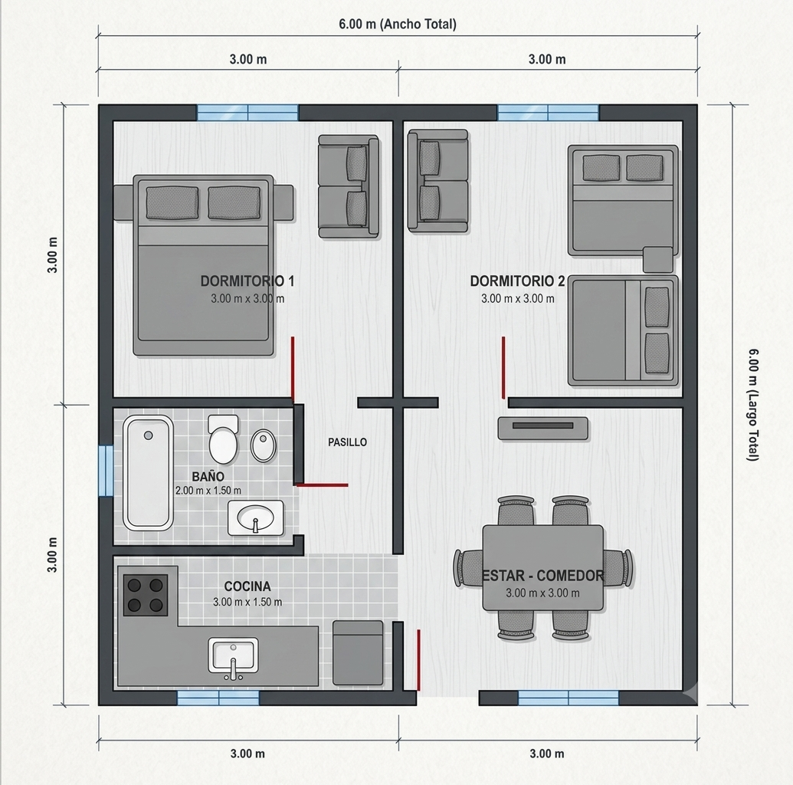
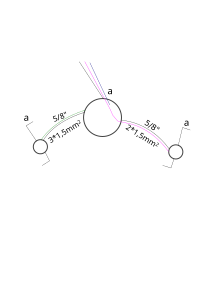

# Actividad

2026-08-12

## 5 Demanda de Potencia Máxima Simultánea (DPMS)

| Circuitos | Norma | N° bocas | Potencia (VA) |
|-----------|-------|----------|---------------|
| IUG | 0.66 * c. b. * 150 | 8 | 792 va |
| TUG | 2200 VA | 1 | 2200 va |
| **DPMS** | | | 2992 va |

## 6 Verificación Grado Electrificación

| Grado | Sup | Pot |
|-----------|-------|
| Minimo | 60m2 | 3,7 kva |
| Minimo | 60m2 | 2,992 kva |

## 7 Verificación corriente del proyecto.

|Circuitos|Potencia (VA)|Tensión (V)|Corriente (A)|
|--|--|--|--|
| IUG | 792 VA | 220 V | 3,6 A |
| TUG | 2200 VA | 220v | 10 A |
| DPMS | 2992 VA | 220 V | 13,6 A |

S = V*I

I = S / V

## 8 Sección

|Circuitos|Corriente (A)|Sección mm2|
|-|-|-|
| IUG | 3,6 | 1,5 |
| TUG | 10 | 2,5 |
| DPMS | 13,6 | 4 |

2026-08-19

## 9 Interruptor termomagnético

|Circuitos|Corriente (A)|Termomagnética|
|-|-|-|
| IUG | 3,6 | 6 |
| TUG | 10 | 16 |
| DPMS | 13,6 | 20 |

Iproyecto &le; Iinterruptor &le; Iconductor

|Iproyecto|&le;|Iinterruptor|&le;|Iconductor|
|-|-|-|-|-|
|3,6| |6| |15|
|10||16||21|
|13,6||20||28|

## 10 Verificar protección de sobrecargas

1. If < 1,45 &times; Ic

2. 1,45 &times; In < 1,45 &times; Ic

|Circuitos|Corriente (A)|Termomagnética|Por tabla (A)|1,45 &times; Ic|
|-|-|-|-|-|
| IUG | 3,6 | 6 |15|21,75|
| TUG | 10 | 16 |21|30,45|
| DPMS | 13,6 | 20 |28|40,6|

## 11 Verificar caída de tensión

<math display="block" style="margin: 0 auto; text-align: left;">
	<mrow>
		<mi>&Delta;u</mi>
		<mo>=</mo>
		<mfrac>
			<mrow>
				<mn>2</mn>
				<mi>L</mi>
				<mi>I</mi>
				<mi>&rho;</mi>
			</mrow>
			<mrow>
				<mi>S</mi>
			</mrow>
		</mfrac>
	</mro>
</math>

|Circuito|Lm|%u|Max %|
|-|-|-|-|
|IUG|20|0,76|3%|
|TUG|36|2,29|5%|

&Delta;u=(2.20.3,6.0,0175)/1,5

&Delta;u=1,68v

%u=(&Delta;u/V).100

%u=(1,68/220).100

%u=0,76

2026-08-24

## Charla Patricio Ramonino

35 35 30

40 40 20

### Etapas

1. Obra desde cero, el mejor momento es cuando el albañil hace la faja, porque queda a la altura de los tableros. Los albañiles nos manejan los tiempos en la obra.

2. Evitar arquitectos, tratar de vender bocas instaladas. El precio promedio es $100.000 por boca (amurada y cableada)

3. Presupuestos: [Electroinstalador](https://www.electroinstalador.com/paginas/p43-cmo-listado-de-costos-de-mano-de-obra)

4. Reparación: (minimo $30.000)
	- Movimiento del Vehículo
	- Gasoil
	- Herramientas

5. Automatización portones, verificar bien

6. División de circuitos:

	1. 1 Disyuntor + 2 térmicas

	2. Puedo resolverlo en 5 minutos o en 1 mes, desmantelar todas las bocas

	3. Desenchufar todo e ir habilitando por circuitos, termicas, y de esa manera aislaos los tomacorrientes

	4. En instalaciones viejas, siempre medir el voltaje antes de trabajar.

	5. Javalina, lo más cercano posible a los electrodomésticos, Heladera, Lavarropas.

	6. Matrícula, firmas

	7. No mezclar los cables de diferentes señales, telefonia, televisión, internet

	8. Si es casa nueva, dejar una cañería para el tanque.

	9. 1,25m e inferior 0,30m - 0,40m
	

2026-08-26

